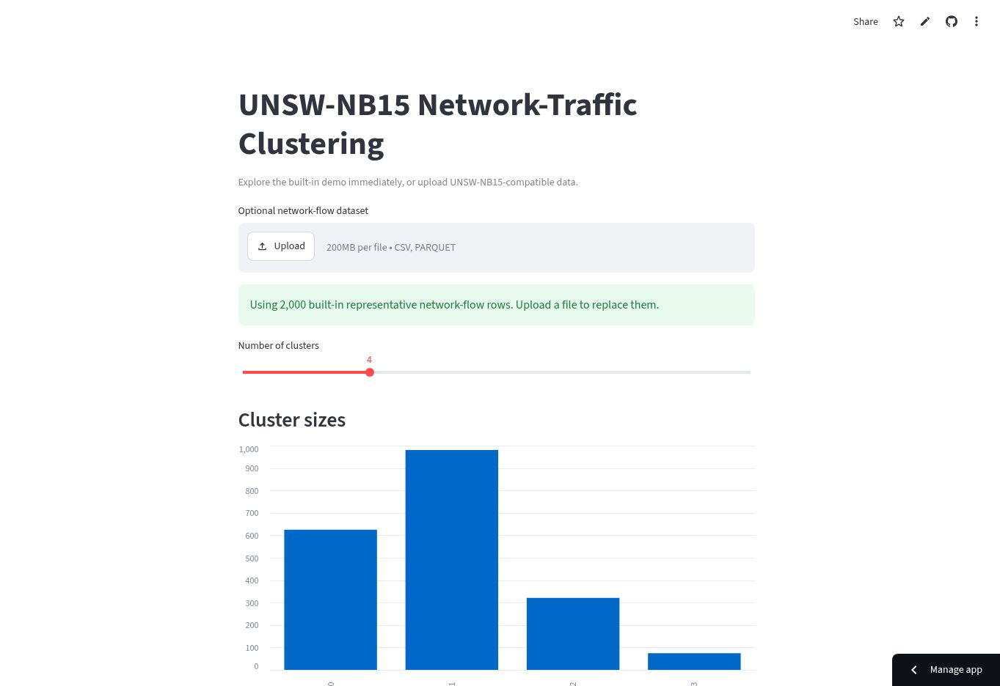

# UNSW-NB15 Network-Traffic Clustering

[](https://karim797-unsw-clustering.streamlit.app/)

Unsupervised analysis of network-flow behaviour using preprocessing, PCA, K-Means, DBSCAN, Agglomerative Clustering, internal validation, cluster profiling, and external label interpretation.



## Methodology

Attack labels are excluded from model inputs and used only after clustering for interpretation. The clean notebook selected Agglomerative Clustering. The interactive dashboard uses K-Means because it supports a practical repeatable workflow for new rows, without changing the notebook conclusion.

## Technologies

Python, Pandas, NumPy, scikit-learn, PCA, K-Means, DBSCAN, Agglomerative Clustering, PyArrow, Matplotlib, Seaborn, Streamlit, Jupyter.

## Project Structure

```text
.
├── app.py
├── clustering_project.ipynb
├── assets/app-screenshot.jpg
├── requirements.txt
├── LICENSE
└── README.md
```

## How to Run

```bash
git clone https://github.com/Karim797/UNSW-NB15-Clustering.git
cd UNSW-NB15-Clustering
python -m venv .venv
source .venv/bin/activate  # Windows: .venv\Scripts\activate
pip install -r requirements.txt
streamlit run app.py
```

The dashboard starts with 2,000 representative demo rows. Uploading a compatible CSV or Parquet file is optional. Place the full dataset in `data/` to reproduce the notebook analysis.

## License

Released under the [MIT License](LICENSE). The UNSW-NB15 dataset remains subject to its original terms and citation requirements.
